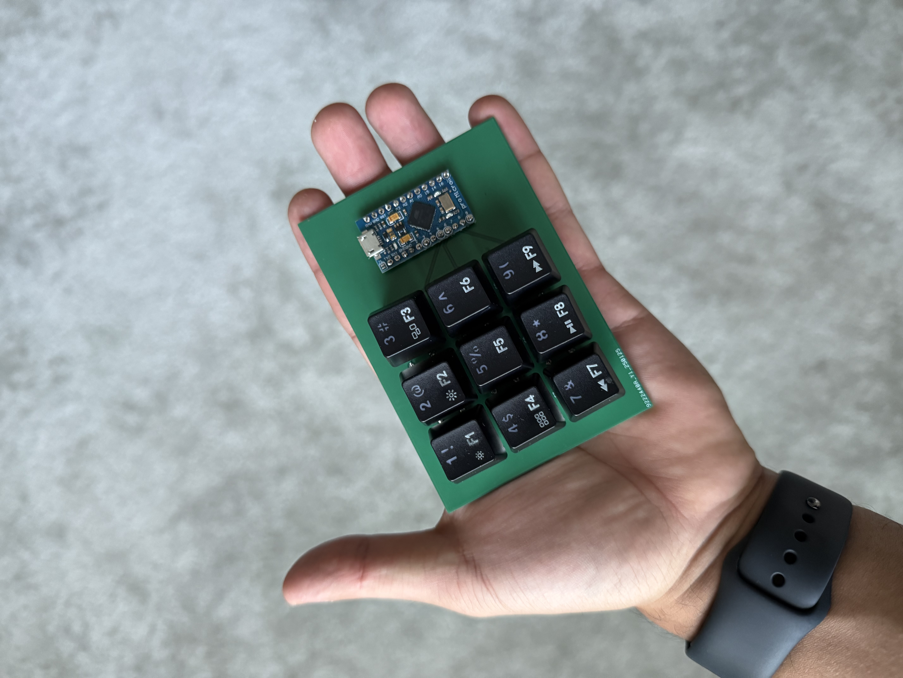

# williams9 Keypad

## Description

* Keyboard Maintainer: [Andrew Williams](https://github.com/andrewimwilliams)
* Hardware Supported:
    - DROP Holy Panda Switches
    - Arduino Pro Micro
    - Chanzon Diodes
    - Custom PCB from JLCPCB
* Hardware Availability:
    - [Switches](https://drop.com/buy/drop-invyr-holy-panda-mechanical-switches?searchId=648c24747bd243da9bf5c01c21cecaa0)
    - [Arduino](https://www.amazon.com/dp/B08BJNV1J3?ref=ppx_yo2ov_dt_b_fed_asin_title&th=1)
    - [Diodes](https://www.amazon.com/dp/B079KJ91JZ?ref=ppx_yo2ov_dt_b_fed_asin_title&th=1)
    - [JLCPCB](https://jlcpcb.com)

## Functions
* Key_1: Opens a new browser window
* Key_2: Opens calculator app
* Key_9: Mute switch

## Setup

Make example for this keyboard (after setting up your build environment):

    make cpcb/williams9:default

Flashing example for this keyboard:

    make cpcb/williams9:default:flash

See the [build environment setup](https://docs.qmk.fm/#/getting_started_build_tools) and the [make instructions](https://docs.qmk.fm/#/getting_started_make_guide) for more information. Brand new to QMK? Start with our [Complete Newbs Guide](https://docs.qmk.fm/#/newbs).

## Bootloader

Enter the bootloader in 3 ways:

* **Bootmagic reset**: Hold down the key at (0,0) in the matrix (usually the top left key or Escape) and plug in the keyboard
* **Physical reset button**: Briefly press the button on the back of the PCB - some may have pads you must short instead
* **Keycode in layout**: Press the key mapped to `QK_BOOT` if it is available